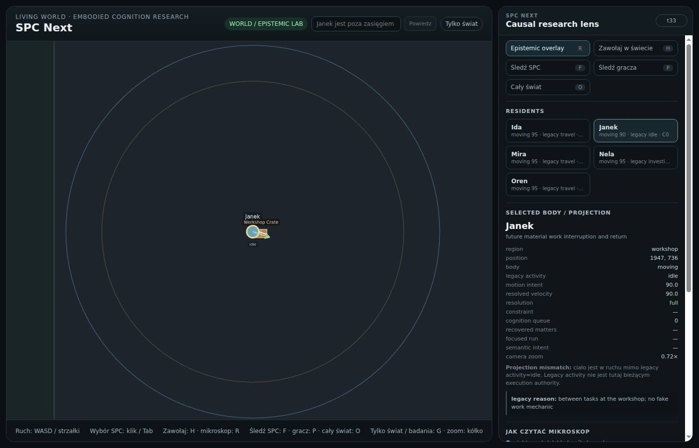
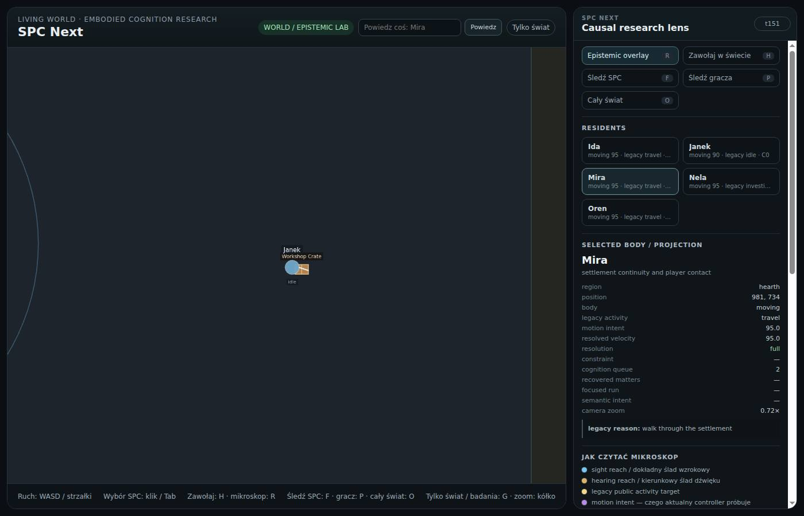
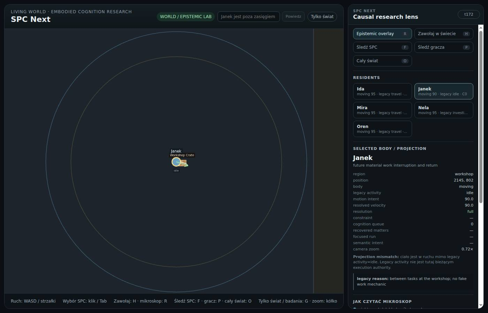
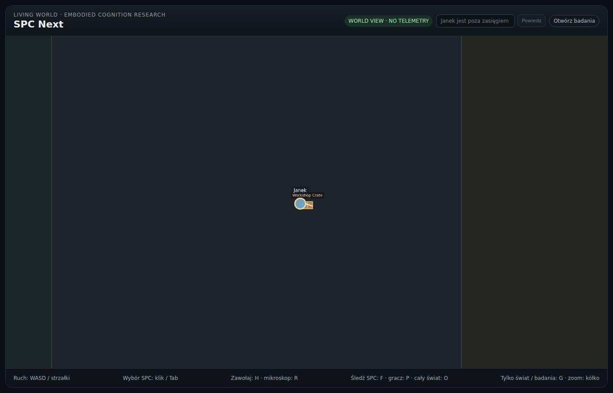
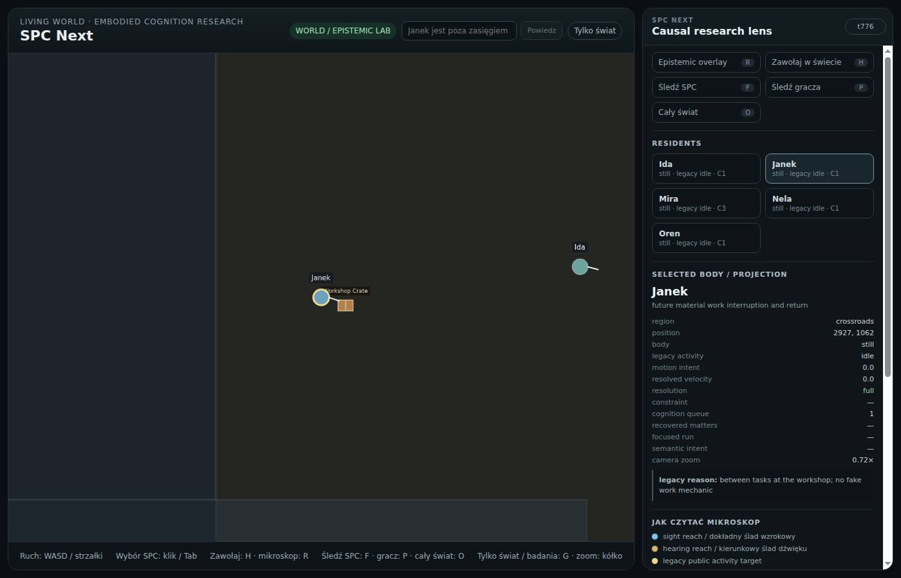
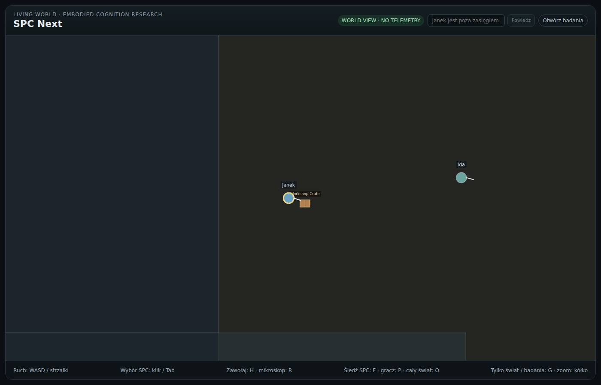

# SPC browser evidence

Source: `ba9f0c4221849723beedfbe856e4aa3728c5ff00`  
Outcome: **PASS**  
Chrome: `Chrome/152.0.7977.82`

## Gates

- PASS: screenshot 01-janek-early-research is non-empty
- PASS: nearby Mira receives player speech through real browser/world path
- PASS: screenshot 02-player-call-mira-research is non-empty
- PASS: Janek produces visible resolved motion during recovered delivery
- PASS: screenshot 03-janek-mid-delivery-research is non-empty
- PASS: screenshot 04-janek-mid-delivery-world is non-empty
- PASS: Janek delivery reaches a settled physical state in browser
- PASS: screenshot 05-janek-settled-research is non-empty
- PASS: screenshot 06-janek-settled-world is non-empty
- PASS: Phaser canvas is present and non-trivial
- PASS: no uncaught browser/runtime errors

## Screenshots

### 01-janek-early-research

Tick: 26 · selected: Janek · world-only: false

### 02-player-call-mira-research

Tick: 138 · selected: Mira · world-only: false

### 03-janek-mid-delivery-research

Tick: 165 · selected: Janek · world-only: false

### 04-janek-mid-delivery-world

Tick: 165 · selected: Janek · world-only: true

### 05-janek-settled-research

Tick: 769 · selected: Janek · world-only: false

### 06-janek-settled-world

Tick: 769 · selected: Janek · world-only: true
