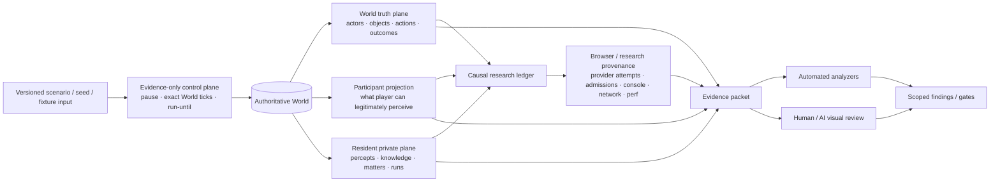
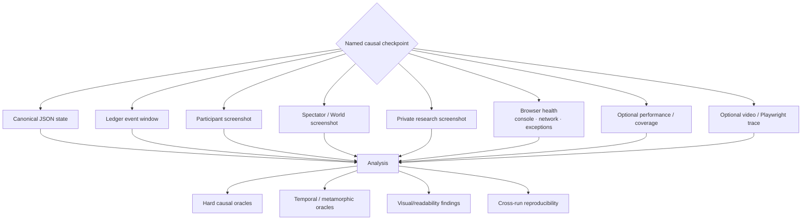
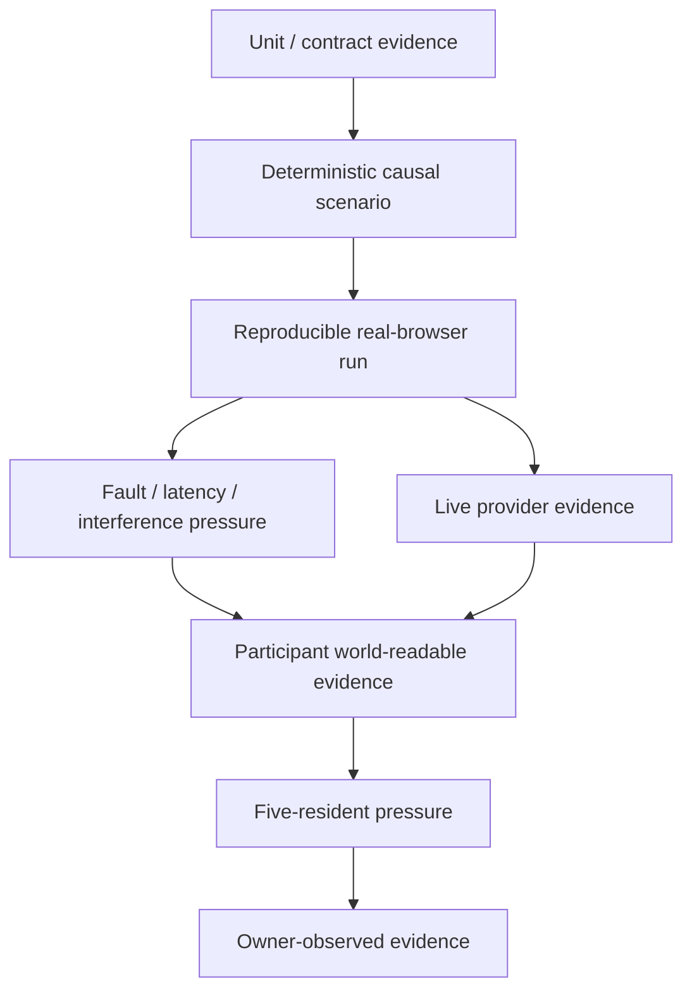
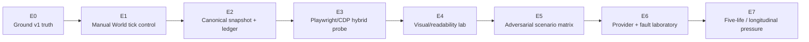

# SPC Autonomous Evidence Observatory — Visual Map

Companion visualization for `SPC_AUTONOMOUS_EVIDENCE_OBSERVATORY_CAMPAIGN.md`.

This file is explanatory, not separate architecture authority.

## 1. Four independent observation planes

Critical boundary: the arrows are observation/correlation paths. Research information must not flow backwards into resident knowledge or participant presentation.

## 2. One causal resident-life chain

```mermaid
flowchart LR
    O[World occurrence / outcome]
    PE[Resident percept evidence]
    K[Knowledge / belief update]
    M[Matter / discrepancy pressure]
    CA[Cognition attempt\nscoped dependencies]
    PR[Provider result]
    AD[Admission / stale / abandon]
    SR[Semantic revision]
    RUN[Exact task / run authority]
    LC[Local embodied control]
    ACT[World action attempt]
    WO[Authoritative World outcome]
    NE[New evidence / matter progress]

    O --> PE --> K --> M --> CA --> PR --> AD --> SR --> RUN --> LC --> ACT --> WO --> NE
    NE -. may pressure .-> M
```

The Observatory should be able to reconstruct this chain without model hidden chain-of-thought.

## 3. Capture at causal checkpoints

## 4. Evidence hierarchy

This is not a strict implementation waterfall. It visualizes why a lower evidence class cannot silently promote a higher claim.

## 5. Immediate campaign sequence

The critical stop-line is E1/E2: do not grow a large scenario suite while causal checkpoints still depend on wall-clock timing or research DOM text as semantic truth.
